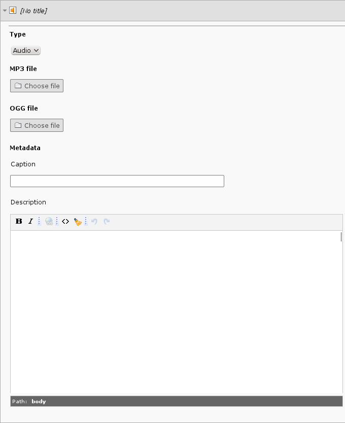
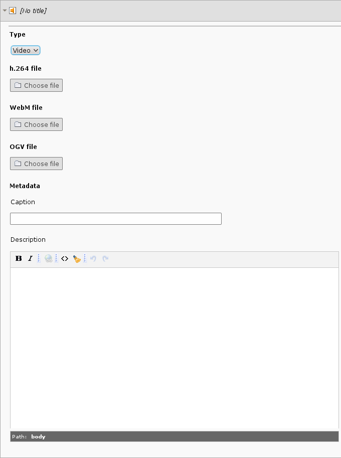

.. include:: ../Includes.txt

.. _introduction:

============
Introduction
============

.. _what-it-does:

What does it do?
================

This extension provides a new content type "Video / Audio". It allows embedding video and
audio files using the corresponding HTML5 elements.

You can upload video and audio files in multiple formats to support more browsers.

.. _screenshots:

Screenshots
===========

   Editing an audio content element

   Editing a video content element
