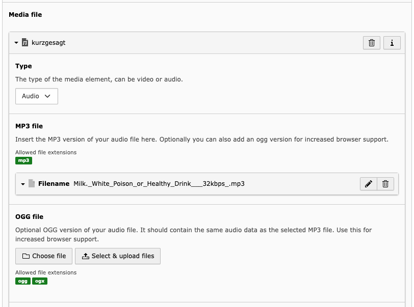
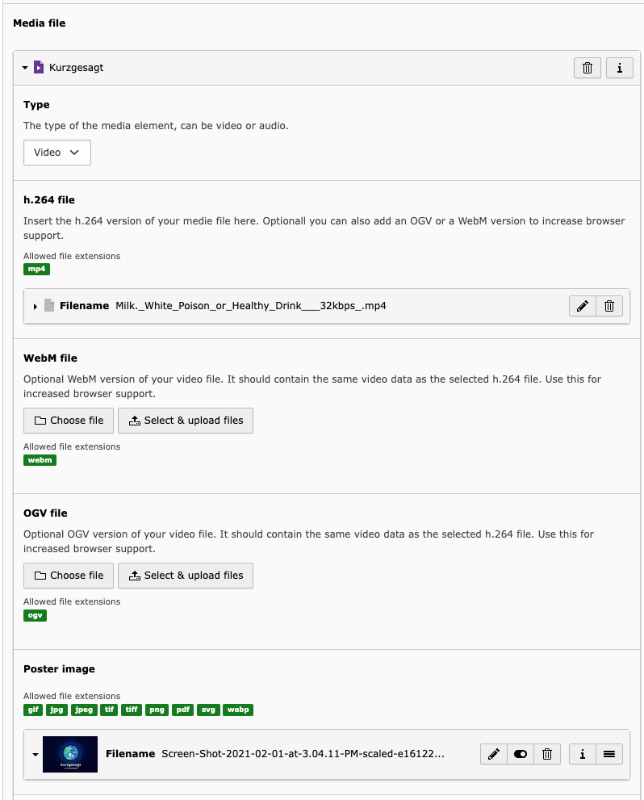

..  include:: /Includes.rst.txt

.. _introduction:

============
Introduction
============

This documentation provides step-by-step instructions for embedding video and audio files on your website using the "Video / Audio" content type. It also covers the process of uploading text WebVTT files as captions for the media file to enhanced accessibility.

.. _what-it-works:

What does it work?
================

This extension introduces a new content type e "Video / Audio" that enhances the functionality of your website. Backend users gain the ability to upload and manage video and audio files in various formats, ensuring compatibility across different browsers.

Under the hood, the extension configures a new media model with the necessary TCA configuration and translation keys. This setup enables seamless integration management of media files within your website's backend.

.. _screenshots:

Screenshots
===========

   Editing an audio content element

   Editing a video content element
